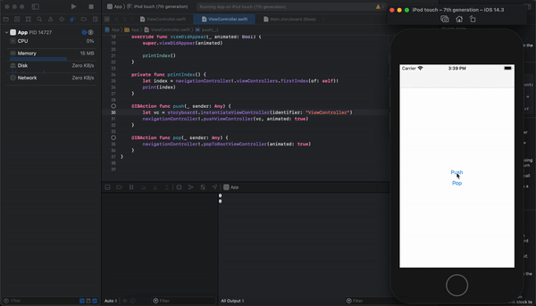

# iOS14 UINavigationController bug

## Env

Xcode 12.3

iPod touch - 7th generation - iOS 14.3

## What is happening?

Methods that modifies multiple viewControllers at once break the order of `viewControllers` as well as elements. We could at least reproduce the same bug with following methods:

* popToRootViewController
* popToViewController
* setViewControllers

## Refs

* https://developer.apple.com/forums/thread/656524
* https://stackoverflow.com/questions/63485966/question-about-ios-14-navigation-stack-management-different-from-ios-13
